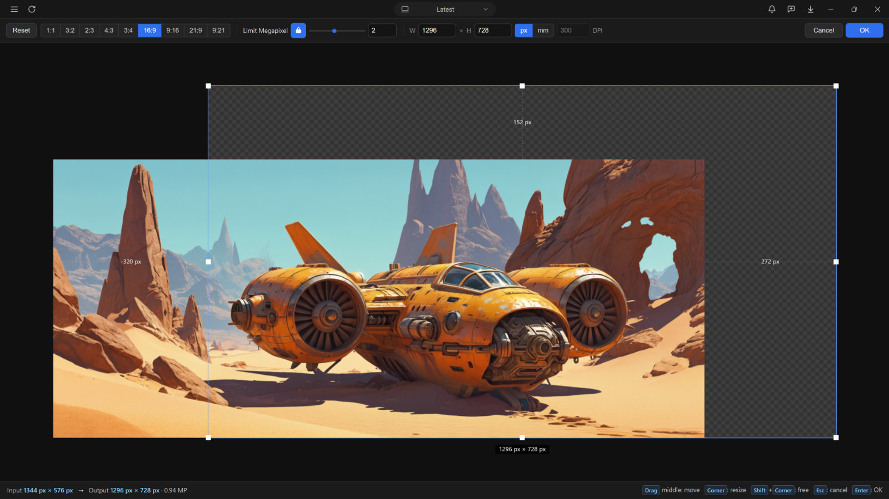
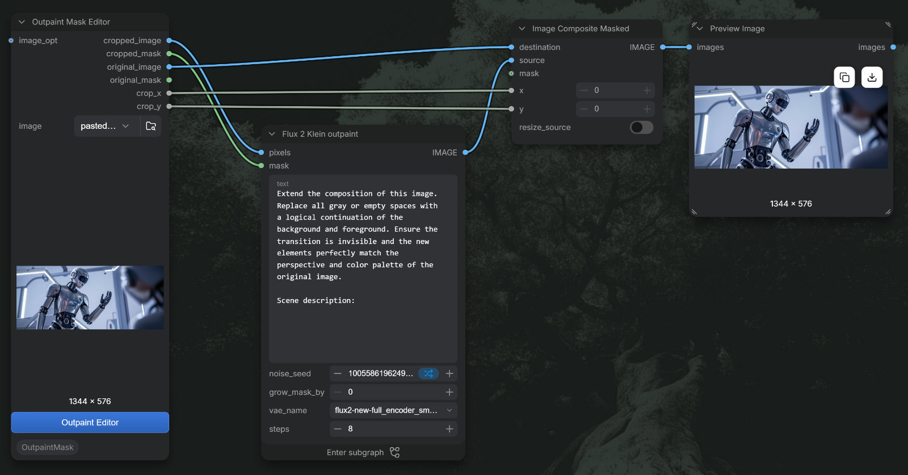

# ComfyUI Outpaint Mask

Custom ComfyUI node for creating **outpaint masks** interactively.

# 

Select or upload an image on the node (or hover the preview and use the
clipboard-paste icon).

- 8 draggable handles: corners resize proportionally by default (hold
  Shift for free resize)
- Snapping to the original image edges and to 16 px multiples.
- Aspect-ratio preset buttons (1:1, 3:2, 2:3, 4:3, 3:4, 16:9, 9:16,
  21:9, 9:21)
- Pixel/millimeter readout switch (px | mm) with a DPI field.
- Adjustable megapixel cap ("Limit megapixel" toggle + slider with
  typical values + narrow manual input) that the frame area cannot exceed.
  Slider stops track native model sizes.

The node outputs:

- `cropped_image` — the frame canvas = your render tile (size and context
  drawn by hand, it may cut into the source), empty outpaint areas are
  mid-gray (128).
- `cropped_mask` — `1.0` where the image must be generated (outside the
  original, inside the frame), `0.0` over the original image.
- `original_image` — FULL canvas (whole source + outpaint expansion,
  nothing cropped away): the source on mid-gray.
- `original_mask` — full-canvas mask: `0.0` over the source and `1.0` in the outpaint area.
- `crop_x` / `crop_y` — top-left position of the tile on the full canvas.
  These outputs enable compositing the generated tile back into `original_image`.

## Compositing: Flux2 Klein example

If we not only want to use outpainting but have also cropped a high-resolution image, we can reinsert the cropped section back into the original image. The basic method is use the Composite node.  

See the [Flux2 Klein sample workflow](examples/flux2_klein_outpaint.json)

# 

##  Install

**Recommended:** install with the ComfyUI extension manager. Open
**Manager → Custom Nodes Manager**, search for **ComfyUI-OutpaintMask**
(author: `zaum`), click **Install**, and restart ComfyUI.

The [Manager listing request](https://github.com/Comfy-Org/ComfyUI-Manager/pull/3293)
is awaiting approval. Search availability depends on approval and catalog refresh;
there is no guaranteed publication time. Use manual installation until it appears.

Screenshot-derived icon and banner assets are configured in `pyproject.toml`
for Registry/Manager views that support them. The legacy Manager catalog has
no thumbnail field; these assets require publication to the Registry to appear
in Registry-backed views.

Manual install: copy (or symlink) this folder into
`ComfyUI/custom_nodes/ComfyUI-OutpaintMask` and restart ComfyUI. No extra
Python dependencies beyond the ComfyUI core.
